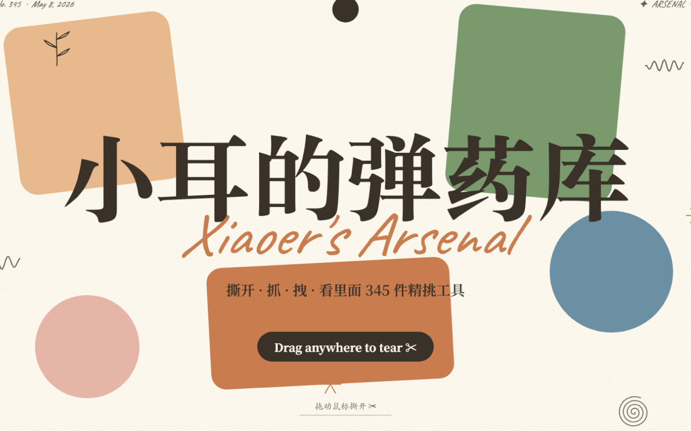
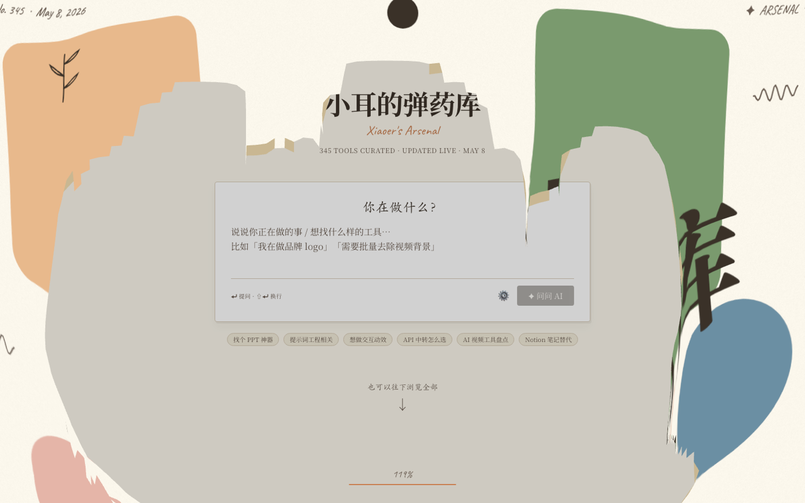
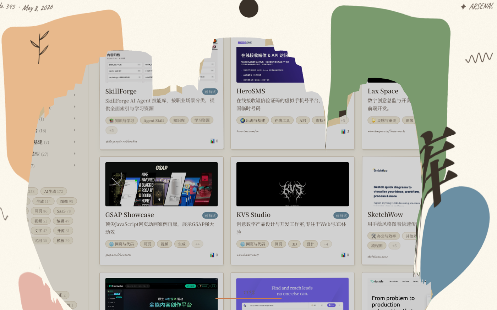

# 小耳的弹药库 / Xiaoer's Arsenal

> **那个网站叫啥来着？**
> 我做了一套自己的工具收藏宇宙 — 浏览器按一下 ⌘D，AI 给它配上分析、截图、分类，自动出现在我的私人工具墙。
>
> *"What was that website called…?" — I built my own tool curation universe. Press ⌘D in any browser; AI captions it, screenshots it, classifies it, and slots it into my private tool wall.*

🌐 在线 / Live: **<https://xiaoer-tools-wall.vercel.app>** （撕一下试试 / Tear it.）


---

## ✨ 这是什么 / What this is

我每天都会在浏览器里发现 5–10 个有意思的网站、工具、灵感站点。两年下来收藏夹有上千条，**全都找不到**。

- **AI 工具？** 我记得收过一个能批量去除视频背景的，叫啥来着？
- **设计灵感站？** 那个有手绘动效的复古站，URL 我忘了。
- **API 中转？** 出海哪家最稳来着？

`Xiaoer's Arsenal` 不是一个收藏夹工具 — 它是一个**用 AI 帮我找回记忆**的私人工具宇宙：

```
浏览器按 ⌘D
   ↓ (FSEvents 实时触发，0 延迟)
后台 watcher 抓住书签变化
   ↓
Playwright 打开网站 → 截图 + 抓 og:image (反爬时用 Gemini Search 兜底)
   ↓
Gemini 2.5 Flash 分析:
  · 干嘛用的 (capabilities)
  · 适合什么场景 (use case)
  · 同义词/别名 (search keywords)
  · 替代什么 / 类似什么 / 配什么用 (alternatives)
  · 智能分类 (12 一级 × 二级)
   ↓
同步写到 Notion + Obsidian + 工具墙 public/covers/
   ↓
自动 vercel deploy → 60 秒内卡片墙上线
   ↓
我跟 AI 多轮对话 ("找个 SVG 动画库"、"提示词工程相关")
   ↓ (我的 key 给我用 / 三层鉴权防白嫖)
AI 从 348 件工具里精准捞出 1-3 个推荐
```

---

## 📸 流程一览 / Walkthrough

| | |
|---|---|
| **入口仪式** — 一张设计过的纸盖住一切，拽鼠标开撕 |  |
| **撕开第一层** — 真实的洞，透过去看到下一层 |  |
| **第二层揭品牌** — "小耳的弹药库 / 343 件精挑工具" |  |
| **再撕开 → 工具墙** — 卡片网格 + AI 多轮对话 |  |
| **滚动浏览** — 12 一级分类 × 二级,按需筛选 |  |

---

## 🏗 仓库结构 / Repo layout

```
xiaoers-arsenal/                 ← 你正在看的这个包
├── README.md                    公开面 (你正在读)
├── CLAUDE.md                    Claude AI 上下文索引,future session 自动加载
├── ARCHITECTURE.md              系统架构 / 数据流图 / 技术选型
├── OPERATIONS.md                运维手册 (部署 / 排错 / 加新工具)
├── CASE_STUDY.md                品牌故事 (对外分享)
├── ROADMAP.md                   未来计划
├── docs/screenshots/            demo 截图
└── code/                        实际代码 (symlink 到本机别处,git 不追踪)
    ├── capture/  →  ~/projects/website-capture/      (Python · watcher + capture)
    ├── wall/     →  ~/projects/xiaoer-tools-wall/    (Next.js + Vercel + Notion)
    └── skills/tearable-cloth/   (沉淀成 skill,已独立成 repo)
```

> 代码留在原位,**没动过任何路径** — launchd 还在跑、Vercel 部署不破。symlink 只是为了方便导航 + 让这个文档包成为 single source of truth。

---

## 🧱 技术栈 / Tech stack

**抓取层 (`code/capture/`)**
- Python 3.13 · `watchdog` (FSEvents) · `playwright` · Gemini 2.5 Flash + Google Search grounding
- macOS `launchd` 守护 · `requests` · 自动 Vercel deploy 收尾

**展示层 (`code/wall/`)**
- Next.js 16 App Router (Turbopack) · React 19 · Tailwind CSS 4
- Notion API (database query + ISR revalidate webhook)
- Vercel deployment + KV (Upstash Redis 限流) + Vercel Blob/static covers
- Three.js + Verlet 物理 (撕扯入口)
- Google Gemini API (BYOK + master + 免费三层鉴权)

**沉淀层 (`code/skills/`)**
- Claude Code Skill 格式 · YAML frontmatter
- 已上架 Claude Code skill 列表

---

## 📚 项目深读 / Deep dives

| 想了解 | 读这个 |
|---|---|
| 整体怎么跑、哪一块在哪里 | [`ARCHITECTURE.md`](ARCHITECTURE.md) |
| Claude / AI Agent 怎么进来理解上下文 | [`CLAUDE.md`](CLAUDE.md) |
| 怎么部署 / 排错 / 加新功能 | [`OPERATIONS.md`](OPERATIONS.md) |
| 这个项目对我意味着什么 | [`CASE_STUDY.md`](CASE_STUDY.md) |
| 后面想加什么 | [`ROADMAP.md`](ROADMAP.md) |
| 撕扯入口怎么做的 | [`code/skills/tearable-cloth/SKILL.md`](https://github.com/Jane-xiaoer/claude-skill-tearable-cloth) |

---

## 📦 状态 / Status

- 🟢 **生产中** · 我每天在用,~ 348 件工具
- 🟢 **完全自动** · 浏览器 ⌘D → 60 秒后工具墙上线
- 🟢 **多浏览器** · Chrome / Brave / Edge / Tabbit / Doubao / Comet / Quark / Dia (FSEvents 自动发现)
- 🟢 **公开 demo** · <https://xiaoer-tools-wall.vercel.app>
- 🟡 **代码未公开** · 包含我的 Notion / API token,需要先脱敏

---

## License

MIT — 文档 + 架构思路。代码部分由各 sub-package 自己的 LICENSE 决定。

---

## 📱 关注作者 / Follow Me

如果这个项目让你觉得"好玩"或者"有用",欢迎关注我。我会持续在公众号 / X 更新更多 AI Skill、工具收藏方法、网站美学和创意工作流。

If this project sparks anything for you, follow along. I'm publishing more AI skills, tool curation methods, web aesthetics, and creative workflows on WeChat & X.

- X (Twitter): [@xiaoerzhan](https://x.com/xiaoerzhan)
- 微信公众号 / WeChat Official Account: 扫码关注 / Scan to follow

<p align="center">
  
</p>

<p align="center"><strong>中文：</strong>欢迎关注我的公众号,一起研究 AI Skill、设计原则、工具宇宙和创意工作流。</p>

<p align="center"><strong>English:</strong> Follow my WeChat Official Account for more AI skills, design principles, tool curation, and creative workflows.</p>
